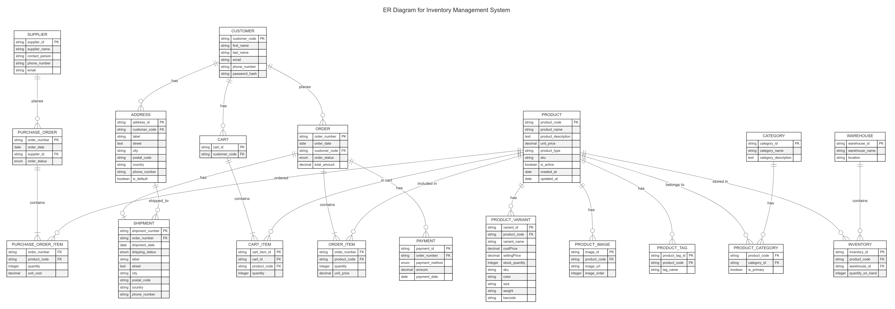

# การออกแบบ ER Diagram สำหรับระบบฐานข้อมูลอีคอมเมิร์ซขนาดใหญ่

**เข้าใจความต้องการของระบบ:**

ก่อนที่จะออกแบบ ER Diagram เราควรเข้าใจความต้องการเฉพาะของระบบอีคอมเมิร์ซของคุณให้ชัดเจนก่อน เช่น

- **สินค้า:** มีหลายประเภท มีตัวแปร (variants) หรือไม่ มีการจัดหมวดหมู่สินค้าอย่างไร
- **ลูกค้า:** มีข้อมูลส่วนบุคคล ประวัติการสั่งซื้อ และที่อยู่จัดส่ง
- **การสั่งซื้อ:** มีกระบวนการชำระเงิน การจัดส่ง และการคืนสินค้า
- **การชำระเงิน:** รองรับหลายช่องทางการชำระเงิน

**โครงสร้างฐานข้อมูลเบื้องต้น:**

จากความเข้าใจเบื้องต้น เราสามารถออกแบบ ER Diagram ได้ดังนี้

## ตารางหลัก

- **Products:** product_id (PK), product_name, description, category_id (FK), price, quantity, is_active, created_at, updated_at
- **Categories:** category_id (PK), category_name, description
- **Customers:** customer_id (PK), first_name, last_name, email, password_hash, phone_number, created_at, updated_at
- **Orders:** order_id (PK), customer_id (FK), order_date, total_amount, status
- **Order_Items:** order_item_id (PK), order_id (FK), product_id (FK), quantity, unit_price
- **Addresses:** address_id (PK), customer_id (FK), address_line1, address_line2, city, state, zip, country, is_billing, is_shipping
- **Payments:** payment_id (PK), order_id (FK), payment_method, amount, payment_date
- **Carts:** cart_id (PK), customer_id (FK)
- **Cart_Items:** cart_item_id (PK), cart_id (FK), product_id (FK), quantity

## ความสัมพันธ์ระหว่างตาราง

- **Products** และ **Categories:** มีความสัมพันธ์แบบ many-to-one โดยสินค้าหนึ่งชิ้นสามารถอยู่ในหมวดหมู่ได้หลายหมวดหมู่ แต่หมวดหมู่หนึ่งสามารถมีสินค้าได้หลายรายการ
- **Customers** และ **Orders:** มีความสัมพันธ์แบบ one-to-many โดยลูกค้าหนึ่งคนสามารถสั่งซื้อได้หลายครั้ง แต่การสั่งซื้อหนึ่งครั้งจะต้องมีลูกค้าเพียงคนเดียว
- **Orders** และ **Order_Items:** มีความสัมพันธ์แบบ one-to-many โดยการสั่งซื้อหนึ่งครั้งสามารถมีสินค้าได้หลายรายการ แต่รายการสินค้าหนึ่งรายการจะอยู่ในออร์เดอร์เพียงหนึ่งรายการ
- **Customers** และ **Addresses:** มีความสัมพันธ์แบบ one-to-many โดยลูกค้าหนึ่งคนสามารถมีหลายที่อยู่ แต่ที่อยู่หนึ่งที่อยู่จะเชื่อมโยงกับลูกค้าเพียงคนเดียว
- **Orders** และ **Payments:** มีความสัมพันธ์แบบ one-to-one โดยการสั่งซื้อหนึ่งครั้งจะมีการชำระเงินหนึ่งครั้ง
- **Customers** และ **Carts:** มีความสัมพันธ์แบบ one-to-one โดยลูกค้าหนึ่งคนจะมีตะกร้าสินค้าเพียงหนึ่งใบ

## เหตุผลในการออกแบบ

- **Normalization:** การออกแบบตารางให้เป็น Normal Form ช่วยลดการซ้ำซ้อนของข้อมูล และเพิ่มความสอดคล้องของข้อมูล
- **Flexibility:** โครงสร้างฐานข้อมูลมีความยืดหยุ่น สามารถรองรับการเพิ่มฟังก์ชันใหม่ๆ ได้ง่าย เช่น การจัดการสินค้าคงคลัง การจัดการโปรโมชั่น หรือการวิเคราะห์ข้อมูลลูกค้า
- **Performance:** การออกแบบดัชนีที่เหมาะสมจะช่วยให้การค้นหาและดึงข้อมูลทำได้รวดเร็วขึ้น
- **Scalability:** โครงสร้างฐานข้อมูลสามารถรองรับปริมาณข้อมูลที่เพิ่มขึ้นได้ในอนาคต

**หมายเหตุ:**

- **Product Variants:** หากสินค้ามีตัวแปร สามารถสร้างตาราง `Product_Variants` เพื่อเก็บข้อมูลรายละเอียดของตัวแปร เช่น สี ขนาด

## ER Diagram

[Mermaid editor](https://www.mermaidchart.com/app/projects/926bfea7-aaf3-4eac-83ea-5eb611e376c7/diagrams/c4d37c11-17bd-46e9-9b12-ef55b5c75df3/version/v0.1/edit)

[Mermaid Diagram](https://www.mermaidchart.com/raw/c4d37c11-17bd-46e9-9b12-ef55b5c75df3)

## MMD (Mermaid Diagram)

```mermaid
erDiagram
    PRODUCT {
        string product_code PK
        string product_name
        text product_description
        decimal unit_price
        string product_type
        string sku
        boolean is_active
        date created_at
        date updated_at
    }

    PRODUCT_VARIANT {
        string variant_id PK
        string product_code FK
        string variant_name
        decimal costPrice
        decimal sellingPrice
        integer stock_quantity
        string sku
        string color
        string size
        string weight
        string barcode
    }

    PRODUCT_IMAGE {
        string image_id PK
        string product_code FK
        string image_url
        integer image_order
    }

    PRODUCT_TAG {
        string product_tag_id PK
        string product_code FK
        string tag_name
    }

    CATEGORY {
        string category_id PK
        string category_name
        text category_description
    }

    PRODUCT_CATEGORY {
        string product_code FK
        string category_id FK
        boolean is_primary
    }

    SUPPLIER {
        string supplier_id PK
        string supplier_name
        string contact_person
        string phone_number
        string email
    }

    PURCHASE_ORDER {
        string order_number PK
        date order_date
        string supplier_id FK
        enum order_status
    }

    PURCHASE_ORDER_ITEM {
        string order_number FK
        string product_code FK
        integer quantity
        decimal unit_cost
    }

    WAREHOUSE {
        string warehouse_id PK
        string warehouse_name
        string location
    }

    INVENTORY {
        string inventory_id PK
        string product_code FK
        string warehouse_id FK
        integer quantity_on_hand
    }

    CUSTOMER {
        string customer_code PK
        string first_name
        string last_name
        string email
        string phone_number
        string password_hash
    }

    ADDRESS {
        string address_id PK
        string customer_code FK
        string label
        text street
        string city
        string postal_code
        string country
        string phone_number
        boolean is_default
    }

    CART {
        string cart_id PK
        string customer_code FK
    }

    CART_ITEM {
        string cart_item_id PK
        string cart_id FK
        string product_code FK
        integer quantity
    }

    ORDER {
        string order_number PK
        date order_date
        string customer_code FK
        enum order_status
        decimal total_amount
    }

    ORDER_ITEM {
        string order_number FK
        string product_code FK
        integer quantity
        decimal unit_price
    }

    SHIPMENT {
        string shipment_number PK
        string order_number FK
        date shipment_date
        enum shipping_status
        string label
        text street
        string city
        string postal_code
        string country
        string phone_number
    }

    PAYMENT {
        string payment_id PK
        string order_number FK
        enum payment_method
        decimal amount
        date payment_date
    }

    CUSTOMER ||--o{ ADDRESS : has
    CUSTOMER ||--o{ CART : has
    CART ||--|{ CART_ITEM : contains
    PRODUCT ||--o{ CART_ITEM : "in cart"
    CUSTOMER ||--o{ ORDER : places
    ORDER ||--|{ ORDER_ITEM : contains
    PRODUCT ||--o{ ORDER_ITEM : "included in"
    ORDER ||--o| SHIPMENT : has
    ADDRESS ||--o{ SHIPMENT : "shipped_to"
    PRODUCT ||--o{ PRODUCT_VARIANT : "has"
    PRODUCT ||--o{ PRODUCT_IMAGE : "has"
    PRODUCT ||--o{ PRODUCT_TAG : "has"
    PRODUCT ||--o{ PRODUCT_CATEGORY : "belongs to"
    CATEGORY ||--o{ PRODUCT_CATEGORY : "has"
    PRODUCT ||--o{ INVENTORY : "stored in"
    WAREHOUSE ||--o{ INVENTORY : "contains"
    SUPPLIER ||--o{ PURCHASE_ORDER : "places"
    PURCHASE_ORDER ||--|{ PURCHASE_ORDER_ITEM : contains
    PRODUCT ||--o{ PURCHASE_ORDER_ITEM : "ordered"
    ORDER ||--o{ PAYMENT : has
```
